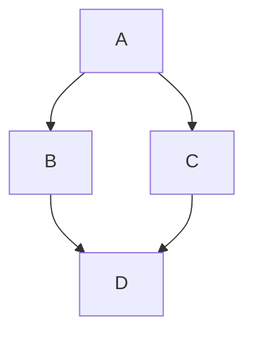

# Sample Document

This is a sample markdown file for E2E testing.

## Introduction

Welcome to the test document. Here we verify rendering capabilities.

## Code Blocks

```javascript
function hello() {
  console.log("Hello, world!");
}
```

## Math

Inline math: $E = mc^2$

Block math:
$$
\sum_{i=1}^{n} x_i = x_1 + x_2 + \cdots + x_n
$$

## Wiki Links

See [[Another Document]] for more info.

## Task List

- [ ] Task one
- [x] Task two
- [ ] Task three

## Image


## Mermaid



## Conclusion

This concludes the sample document.
