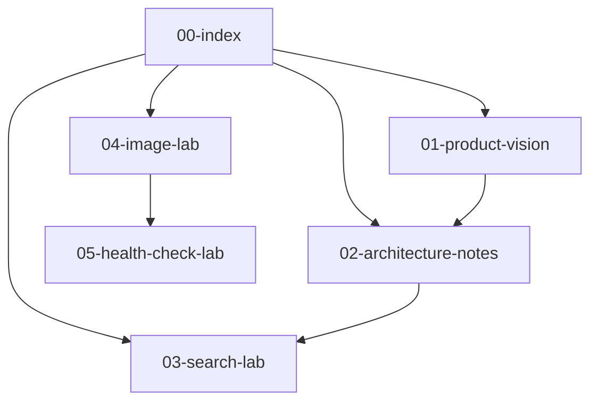

# Demo Knowledge Base

这是一个用于演示 AI Markdown Reader 新功能的小型知识库。建议用“打开文件夹”选择 `examples/demo-knowledge-base`，再从这份文档开始阅读。

## 推荐测试路线

1. 打开工具菜单，查看“文档图谱”。
2. 打开 [[01-product-vision|产品愿景]]，再查看“反向引用”。
3. 打开 [[03-search-lab|搜索实验室]]，测试全局搜索的文件名、标题、正文过滤。
4. 打开 [[04-image-lab|图片实验室]]，测试图片检查面板。
5. 打开 [[05-health-check-lab|健康检查实验室]]，测试文档健康检查。
6. 从文件列表手动打开 `06-orphan-note.md`，观察它在图谱里的孤立状态。

## 知识库地图

## 快速搜索词

你可以在全局搜索里试这些词：

| 搜索词 | 推荐范围 | 预期效果 |
| --- | --- | --- |
| `workspace` | 正文 | 找到工作区相关说明 |
| `反向引用` | 标题 | 找到对应章节 |
| `Mermaid` | 全部 | 找到图表和健康检查说明 |
| `image-lab` | 文件名 | 找到图片实验室 |

## 这份文档链接到哪里

- [[01-product-vision]]
- [[02-architecture-notes]]
- [[03-search-lab]]
- [[04-image-lab]]
- [[05-health-check-lab]]
