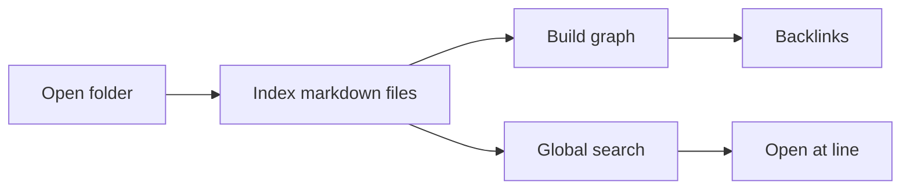

# 架构笔记

这份文档用于演示文档图谱和标题搜索。

## 当前模块

| 模块 | 作用 |
| --- | --- |
| Wiki Graph | 从 `[[Wiki Link]]` 构建节点和边 |
| Backlinks | 找到指向当前文件的来源 |
| Workspace | 保存文件夹和标签快照 |
| Reading Timeline | 记录阅读进度 |
| Search Index | 支持文件夹级全文搜索 |

## 文档图谱

文档图谱从当前文件夹的索引内容里提取 Wiki Link。比如本页链接到 [[01-product-vision]] 和 [[03-search-lab]]。

## Mermaid architecture

## 工作区恢复

工作区功能保存当前文件夹，并记录相关标签页。下次打开工作区时，应用会尝试恢复这些标签。

关键词：workspace session, tabs, source line, restore.

