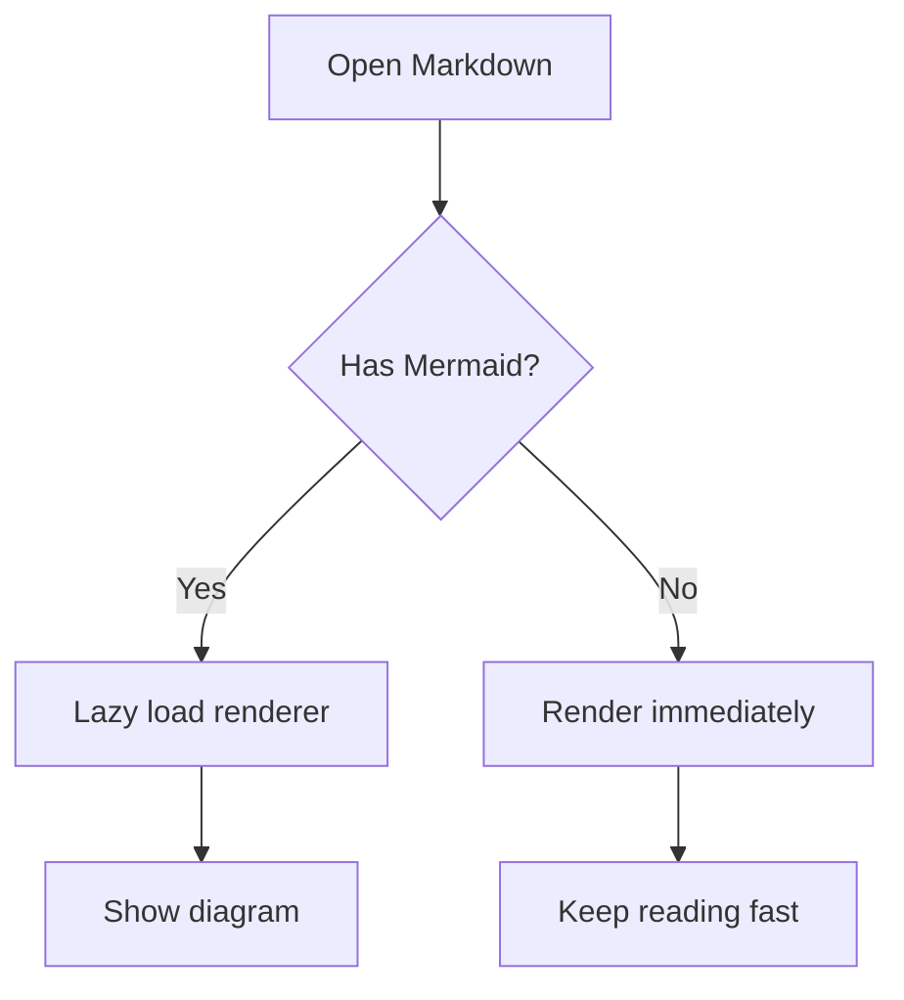

# Markdown Reader Smoke Test

这份文档用于打包后快速验收核心阅读能力。建议每次发布前用最新版应用打开一次，并按下面的检查点走完。

## 1. 基础 Markdown

普通段落、**加粗文本**、*斜体文本*、`inline code` 和链接：[GitHub](https://github.com)。

> 引用块应该有清晰的左侧边线和合适的阅读间距。

## 2. 目录与跳转

如果大纲开启，左侧目录应该包含本文所有二级标题。滚动到不同章节时，当前目录项应随阅读位置高亮。

## 3. 代码高亮

```typescript
type DocumentTab = {
  id: string
  title: string
  path: string
  pinned?: boolean
}

function formatTitle(tab: DocumentTab): string {
  return tab.pinned ? `[Pinned] ${tab.title}` : tab.title
}
```

```diff
@@ Markdown Reader @@
- remove unused advanced features
+ keep focused reading features
```

## 4. KaTeX 数学公式

行内公式应该正常渲染：$E = mc^2$。

块级公式应该居中显示：

$$
\sum_{i=1}^{n} x_i = x_1 + x_2 + \cdots + x_n
$$

## 5. Mermaid 图表

普通文档首次打开时不应提前加载 Mermaid；只有到包含图表的文档时才渲染。



## 6. 表格

| Feature | Expected result |
| --- | --- |
| Search | Match text is highlighted |
| Theme | Light, dark, and sepia switch correctly |
| Export | HTML/PDF keep readable formatting |

## 7. 任务列表

- [ ] 点击后应能切换勾选状态
- [x] 已完成项应保持选中
- [ ] 关闭并重新打开后状态应恢复

## 8. WikiLink

下面两个链接应渲染为可点击的 WikiLink：

- [[Project Notes]]
- [[显示名称|Project Notes]]

## 9. 图片

如果网络可用，下面的图片应懒加载，并支持点击预览。


## 10. 发布前检查清单

- [ ] 打开文件
- [ ] 打开文件夹
- [ ] 搜索 `Reader`
- [ ] 切换主题
- [ ] Mermaid 渲染成功
- [ ] KaTeX 渲染成功
- [ ] 导出 HTML
- [ ] 打印或另存 PDF
- [ ] 重启后恢复标签、主题、阅读位置
