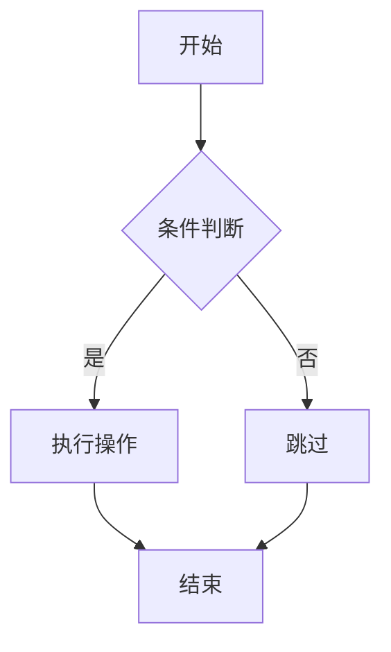

# 综合测试文档

这是一个覆盖所有 Markdown 语法的测试文档，用于验证 v2 渲染引擎的正确性。

## 基础语法

普通段落文本，包含 **加粗**、*斜体*、~~删除线~~、`行内代码`。

- 无序列表项 1
- 无序列表项 2
  - 嵌套项
- 无序列表项 3

1. 有序列表项 1
2. 有序列表项 2
3. 有序列表项 3

> 这是一个引用块。
> 第二行引用。

---

## 任务列表

- [x] 已完成的任务
- [ ] 未完成的任务
- [ ] 另一个未完成任务

## 代码块

```javascript
function hello(name) {
  console.log(`Hello, ${name}!`)
  return { success: true }
}
```

```python
def factorial(n):
    if n <= 1:
        return 1
    return n * factorial(n - 1)
```

```diff
+ 新增的行
- 删除的行
@@ 段落标记 @@
```

## 表格

| 功能 | 支持状态 | 说明 |
|------|---------|------|
| 标题 | ✅ | h1-h6 全支持 |
| 代码高亮 | ✅ | Prism JS/Python/Diff |
| 表格 | ✅ | GFM 表格 |
| Mermaid | ✅ | 流程图/时序图 |

## 数学公式

行内公式：$E = mc^2$ 和 $\sum_{i=1}^{n} i = \frac{n(n+1)}{2}$

块级公式：

$$
\int_{0}^{\infty} e^{-x^2} dx = \frac{\sqrt{\pi}}{2}
$$

## 链接与 WikiLink

[外部链接](https://github.com) 和 [相对链接](./other.md)

WikiLink：[[other-note]] 和 [[other-note|显示名称]]

## Mermaid 图表



## Emoji

:smile: :rocket: :thumbsup: :heart: :fire:

## 长文本段落

这是一个较长的段落，用于测试文本的自动换行和行间距是否合理。在 Markdown 阅读器中，长段落的可读性非常重要，需要有适当的行高、段距和最大宽度限制。这段文字应该会在 820px 的最大宽度内自动换行，不会撑满整个屏幕。如果你看到这段文字的排版舒适，说明基础排版功能正常工作。
