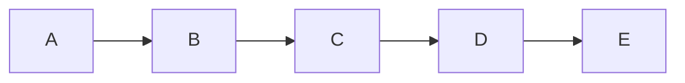

# 大文档性能测试

## 第一节

内容填充。Lorem ipsum dolor sit amet, consectetur adipiscing elit. Sed do eiusmod tempor incididunt ut labore et dolore magna aliqua.

## 第二节

更多内容。Ut enim ad minim veniam, quis nostrud exercitation ullamco laboris nisi ut aliquip ex ea commodo consequat.



## 第三节

表格测试：

| 名称 | 类型 | 值 |
|------|------|-----|
| alpha | number | 100 |
| beta | string | hello |
| gamma | boolean | true |
| delta | object | {a:1} |
| epsilon | array | [1,2,3] |

## 第四节

数学公式块：

$$
f(x) = ax^2 + bx + c
$$

## 第五节

代码：

```typescript
interface Config {
  port: number
  host: string
  debug: boolean
}

const config: Config = {
  port: 3000,
  host: 'localhost',
  debug: true,
}
```

## 第六节

引用块：

> 这是一段引用文字。
>
> 引用的第二段。

## 第七节

任务列表：

- [x] 任务一
- [x] 任务二
- [ ] 任务三
- [ ] 任务四

## 第八节

更多文本段落用于测试虚拟滚动。这段文字会被重复多次以产生足够的内容。

## 第九节

继续填充内容以确保文档足够长，触发虚拟渲染模式。

## 第十节

这是第十节。如果你能看到这里，说明滚动正常。

## 第十一节

$E = mc^2$ 是质能方程。

## 第十二节

```python
import sys
print(sys.version)
```

## 第十三节

| 列1 | 列2 | 列3 |
|-----|-----|-----|
| 数据1 | 数据2 | 数据3 |
| 数据4 | 数据5 | 数据6 |
| 数据7 | 数据8 | 数据9 |

## 第十四节

> 引用块测试第二弹。

## 第十五节

- [x] 最后一个任务
